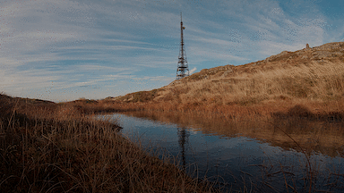
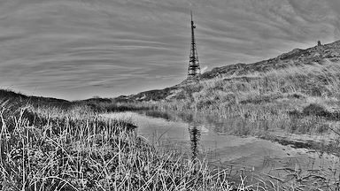
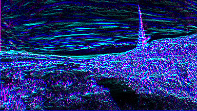
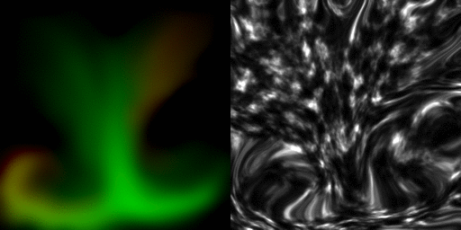
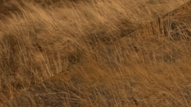

# stx_tools

VFX Tools, mostly Fusion related. Some Houdini, Blender and Shell related.

## Fusion Macros 
stx_deflicker     - Simple deflicker for global flicker removal.  

  

stx_highpass      - Highpass filter, for easy tracking and finding edges.  

  

stx_loopzilla     - Soft looper for clips. Makes looping elements much easier.  
stx_pMatte        - Create mattes from World space position, sphere, cube or noise. Can be daisy-chained for complex shapes.  

  

stx_slopeAndDot   - Figures out the slope/derivative of the incoming image and outputs it in RG and the dot product in B.  

  

stx_strangeLoop   - Can create infinite looping / displacing effect.  

  

stx_tileTexture   - Simple texture tiler with soft blend and optional removal of shadows / low freq detail.  

  

stx_vectorDenosie - Simple Temporal median or average of 3 frames to produce a clean image based on motion vectors  

  

